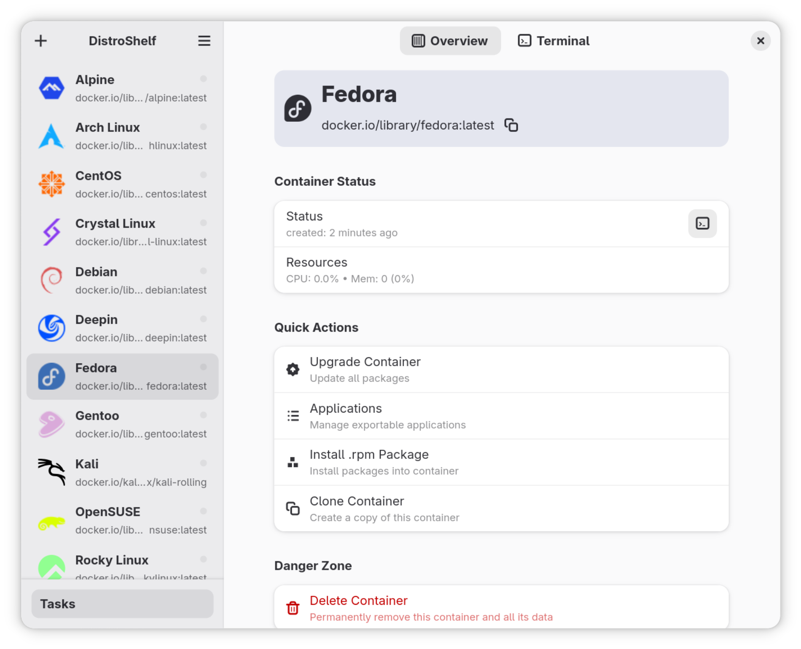

# DistroShelf - A GUI for Distrobox Containers

<p align="center">
  
</p>

DistroShelf is a graphical interface for managing [Distrobox](https://distrobox.it/) containers on Linux. It provides an easy way to:

- Create and manage containers
- View container status and details
- Install packages
- Manage exported applications
- Open terminal sessions
- Upgrade containers
- Clone and delete containers



## Installation
[](https://repology.org/project/distroshelf/versions)

### Flatpak
<a href='https://flathub.org/apps/com.ranfdev.DistroShelf'>
  
</a>

or

```bash
flatpak install com.ranfdev.DistroShelf
```

### Third party packages
#### Arch linux
`distroshelf` is on the [AUR](https://aur.archlinux.org/packages/distroshelf)

#### NixOS
`distroshelf` on nixpkgs-unstable

### From Source

#### Requirements
- Distrobox installed and configured
- GTK 4 and libadwaita
- Supported terminal emulator (GNOME Terminal, Konsole, etc.)

#### Steps
1. Clone the repository:
```bash
git clone https://github.com/ranfdev/DistroShelf.git
cd DistroShelf
```

2. Build and install:
```bash
meson build --prefix=/usr
ninja -C build
sudo ninja -C build install
```

## Configuration

You can configure your preferred terminal emulator in the Preferences dialog.

Supported terminals:
- GNOME Terminal
- Konsole
- Xfce Terminal
- Tilix
- Alacritty
- And more...

## Contributing

Contributions are welcome! Please open an issue or pull request on GitHub.

## License

DistroShelf is licensed under the GPL-3.0-or-later license.

## Credits

- Distro icons from [font-logos](https://github.com/lukas-w/font-logos)
- Some snippets are from [BoxBuddy](https://github.com/Dvlv/BoxBuddyRS)
- [Distrobox](https://distrobox.it/)
